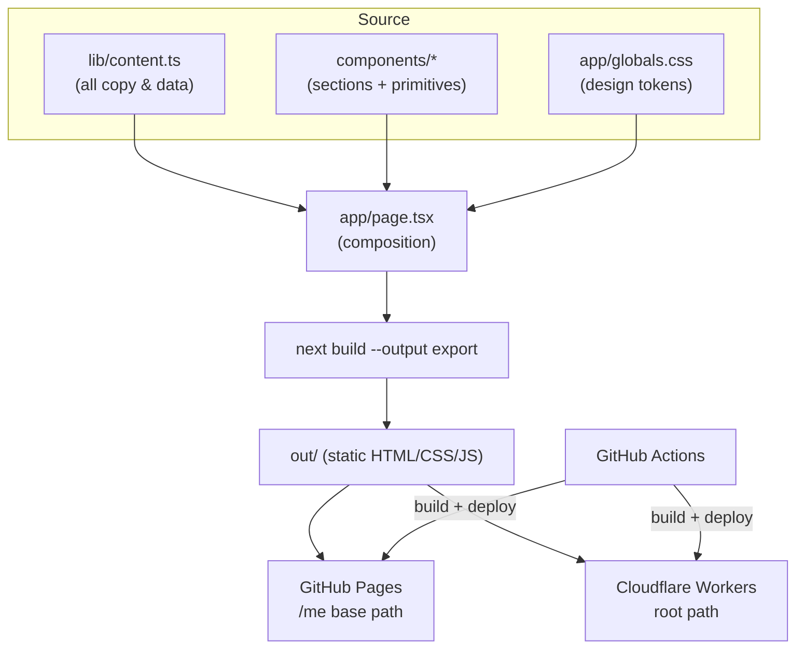

<div align="center">
  

  # Saad Bhutto — Portfolio

  **AI-Native Tech Lead &amp; Senior Full-Stack Engineer** · Melbourne, VIC

  A fast, dark, motion-driven personal portfolio built as a fully static site.

  🌐 **Live:** [saad-bhutto.github.io/me](https://saad-bhutto.github.io/me/) · [saad-portfolio.devkind.workers.dev](https://saad-portfolio.devkind.workers.dev)
</div>

---

## Overview

A single-page portfolio positioning Saad Bhutto for senior AI/engineering roles. It leads with a word-reveal hero, a technology marquee, selected work (with concept visuals), a "T-shaped" differentiation table, expertise, quantified impact, an integrations carousel, and an about section — all in a refined dark aesthetic with a single hot accent.

The whole site is **statically pre-rendered** (no server, no database), so it deploys to any static host and runs at CDN speed.

## Tech stack

| Layer | Choice |
|---|---|
| Framework | **Next.js 15** (App Router) with `output: 'export'` (static HTML) |
| Language | **TypeScript**, React 19 |
| Styling | **Tailwind CSS v4** (CSS-first `@theme`, design tokens as CSS variables) |
| Motion | **Framer Motion** (scroll reveals, word-by-word accent flash) |
| Icons | `react-icons` (Simple Icons + Font Awesome) — bundled, no external requests |
| Testing | **Vitest** + Testing Library (jsdom) |
| Hosting | **GitHub Pages** (primary) + **Cloudflare Workers** static assets |
| CI/CD | **GitHub Actions** — auto-deploy on push to `main` |

## Architecture



**Key design decisions**

- **Content is data, not markup.** Every string, metric, case study, integration, and nav item lives in [`lib/content.ts`](lib/content.ts). Section components are thin and just map over that data — copy edits never touch JSX.
- **Three-tier styling.** Primitive tokens (`--bg`, `--accent`, …) → Tailwind theme mapping (`@theme inline`) → components. One accent (`#FB411E`) used sparingly on pure black.
- **Reusable motion primitives.** `WordReveal` (scroll-triggered, per-word accent flash) and `Reveal` (fade-and-rise) both use `useInView` for reliable above-the-fold triggering, respect `prefers-reduced-motion`, and stay visible without JS via a `<noscript>` fallback.
- **Environment-driven base path.** The same build serves two hosts: `NEXT_PUBLIC_BASE_PATH` is empty for Cloudflare (root) and derived from the repo name for GitHub Pages (`/me`). This is why a repo rename won't break asset URLs.
- **Graceful portrait.** `components/portrait.tsx` shows `/portrait.jpg` when present and a monogram placeholder otherwise, handling pre-hydration 404s.

## Project structure

```
.
├── app/
│   ├── layout.tsx          # metadata/SEO, fonts, no-JS reveal fallback
│   ├── page.tsx            # section composition
│   └── globals.css         # design tokens, marquee + reveal CSS
├── components/             # nav, hero, featured-work, about, comparison-table,
│                           # services, impact, integrations-carousel, footer,
│                           # + primitives: word-reveal, reveal, pill-button,
│                           #   section-heading, card, case-visual, portrait, time-zones
├── lib/
│   ├── content.ts          # ALL site copy & data (single source of truth)
│   ├── fonts.ts            # next/font wiring
│   └── use-prefers-reduced-motion.ts
├── tests/                  # Vitest component/content tests
├── public/portrait.jpg     # headshot
├── .github/workflows/
│   ├── pages.yml           # deploy → GitHub Pages
│   └── deploy.yml          # deploy → Cloudflare Workers
├── next.config.ts          # static export + env base path
└── wrangler.jsonc          # Cloudflare Workers static-assets config
```

## Sections

Hero · Tech marquee · Selected work (SVG concept visuals) · About · "The Combination" comparison table · Expertise · Impact metrics · Integrations carousel · Footer CTA + rich footer (live timezone clocks).

## Local development

```bash
nvm use            # Node 22 (see .nvmrc)
npm install
npm run dev        # http://localhost:3000
npm test           # Vitest
npm run build      # static export → out/
```

## Deployment

Pushing to `main` triggers both GitHub Actions workflows:

- **GitHub Pages** (`pages.yml`) — builds with the repo-name base path, adds `.nojekyll`, publishes to Pages.
- **Cloudflare Workers** (`deploy.yml`) — builds at root and runs `wrangler deploy` (requires repo secrets `CLOUDFLARE_API_TOKEN` and `CLOUDFLARE_ACCOUNT_ID`).

Manual Cloudflare deploy:

```bash
npm run deploy     # next build && npx wrangler deploy
```

## Design system

- **Background** `#000000` · **Surface** `#1C1C1C` · **Text** `#FFFFFF` / muted white
- **Accent** `#FB411E` — one hot color, used sparingly
- **Type** Inter (display + body), tight tracking, weight 400 headings
- Refined minimalism, generous whitespace, scroll-driven motion
